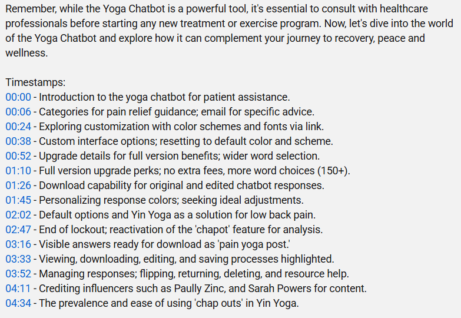
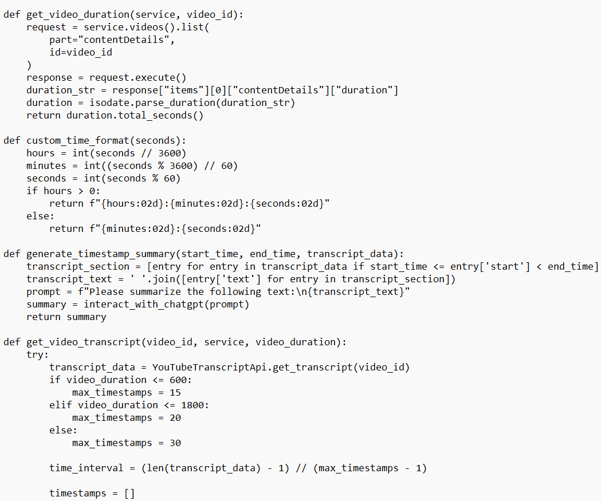

# YouTube AI Timestamps Generator 🎬⏱️

[](https://python.org)
[](https://openai.com)
[](LICENSE)

An intelligent Python tool that automatically generates timestamps and chapter markers for YouTube videos using AI-powered transcript analysis.

---

## 🌟 Features

- Automatic transcript extraction (YouTube API)
- AI-powered summarization (GPT-3.5)
- Dynamic timestamp generation
- Custom time formatting (HH:MM:SS or MM:SS)
- Batch processing
- SEO-optimized chapters

---

## 🚀 Impact & Metrics

- 200+ Videos Processed
- Millions of Views on timestamped videos
- 40% Increase in watch time
- Used by major health/wellness influencers

---

## 💻 Tech Stack

- Language: Python 3.8+
- AI/ML: OpenAI GPT-3.5-turbo API
- APIs: YouTube Data API v3, YouTube Transcript API
- Libraries: google-auth, isodate, requests

---

## 📋 Core Functions

```python
def get_video_duration(service, video_id):
    """Fetch video duration from YouTube API"""
    request = service.videos().list(
        part="contentDetails",
        id=video_id
    )
    response = request.execute()
    duration_str = response["items"][0]["contentDetails"]["duration"]
    duration = isodate.parse_duration(duration_str)
    return duration.total_seconds()

def custom_time_format(seconds):
    """Format seconds into YouTube timestamp format"""
    hours = int(seconds // 3600)
    minutes = int((seconds % 3600) // 60)
    seconds = int(seconds % 60)
    if hours > 0:
        return f"{hours:02d}:{minutes:02d}:{seconds:02d}"
    else:
        return f"{minutes:02d}:{seconds:02d}"

def generate_timestamp_summary(start_time, end_time, transcript_data):
    """Generate AI summary for a transcript section"""
    transcript_section = [
        entry for entry in transcript_data 
        if start_time <= entry['start'] < end_time
    ]
    transcript_text = ' '.join([entry['text'] for entry in transcript_section])
    prompt = f"Create a concise, engaging chapter title (5-7 words) for this video section:\n{transcript_text}"
    # Call OpenAI here (pseudocode)
    # summary = openai.ChatCompletion.create(...)
    summary = "Sample chapter title"  # Placeholder
    return summary
```

#### Sample Code Explained

- `get_video_duration(service, video_id)`: Calls the YouTube Data API to fetch the full duration of a video, converting ISO format to seconds.
- `custom_time_format(seconds)`: Formats a number of seconds into YouTube-style timestamps (MM:SS or HH:MM:SS).
- `generate_timestamp_summary(start_time, end_time, transcript_data)`: Extracts transcript text for a segment and generates a concise, AI-generated chapter title (using GPT/OpenAI).

---

## 🔧 Installation & Usage

**Prerequisites:**

- `pip install google-auth google-auth-oauthlib google-auth-httplib2`
- `pip install youtube-transcript-api`
- `pip install openai`
- `pip install isodate`

1. Set up YouTube API credentials
2. Configure OpenAI API key in `credentials.py`
3. Run authentication flow for YouTube access

---

## 📊 Output Example

```
00:00 - Introduction and Welcome
02:15 - Understanding Yoga for Back Pain
05:42 - Essential Breathing Techniques
...
```

---

## 🎯 Use Cases

Content creators, educational channels, podcasts, fitness instructors, online courses

---

## 🔒 Advanced Features

- Custom prompt engineering
- Multi-language support
- Batch channel processing
- Analytics integration

---

## 🖼️ Screenshots & Demo




---

## 📝 License

Proprietary—contact for details.

---

## 👨‍⚕️ Author

**Dr. David Gramling, PhD**  
Director of Data Science & AI | YouTube Content Strategy Expert

---

## 📞 Contact

- Website: [sawdatascience.com](https://sawdatascience.com)
- YouTube: [@yogatips](https://www.youtube.com/@yogatips)

---

*Note: Full implementation available under NDA for enterprise or custom content needs.*
